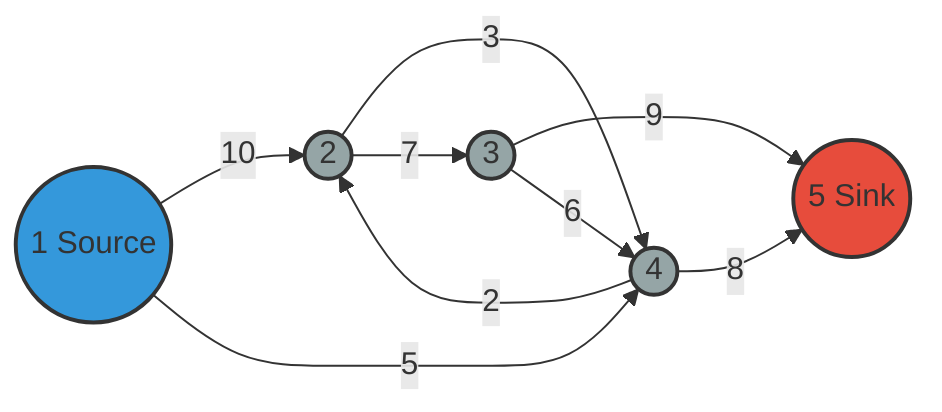

# Lecture 3: Network Flow Problems

## Introduction to Network Flows

Network flow problems represent an important class of algorithmic problems with numerous practical applications:

- Used for modeling the transport of commodities from a source to a sink
- Have significant practical importance in various domains
- Entire books are dedicated to this topic (e.g., works by Ravindra Ahuja, Katta G. Murthy)

## Network Flow Problem Definition

### Basic Components

A network flow problem consists of:

1. **Graph Structure**: A directed graph $G = (V, E)$
2. **Special Nodes**:
   - Source node (s): Where flow originates
   - Sink node (t): Where flow terminates
3. **Capacities**: Each edge $(u, v) \in E$ has a capacity $c(u, v)$ representing the maximum flow allowed through that edge

### Example Network

In our example, we have a 5-node network with:
- Node 1 as the source
- Node 5 as the sink
- Directed edges with the following capacities:
  - Edge (1,2): Capacity 10
  - Edge (1,4): Capacity 5
  - Edge (2,4): Capacity 3
  - Edge (2,3): Capacity 7
  - Edge (3,5): Capacity 9
  - Edge (3,4): Capacity 6
  - Edge (4,5): Capacity 8
  - Edge (4,2): Capacity 2

Below is a graph diagram:

### Objective

The goal is to **maximize** the amount of commodity (e.g., oil) sent from the source to the sink.

## Flow Constraints

Three essential constraints must be respected:

### 1. Flow Direction Constraint

- Flow can only be sent along edges in the direction they exist in the graph
- For example, if there's an edge from 1 to 2, flow can go from 1 to 2 but not from 2 to 1 (unless there's a separate edge from 2 to 1)

### 2. Capacity Constraint

- The amount of flow on an edge cannot exceed its capacity
- Mathematically: For every edge $(u,v)$, $f(u,v) \leq c(u,v)$
- Example: If edge (1,2) has capacity 10, we can send at most 10 units of flow through it

### 3. Flow Conservation (Kirchhoff's Law)

- For any node other than the source and sink, the total incoming flow must equal the total outgoing flow
- Mathematically: For each node $v \neq s,t$: $\sum_{u} f(u,v) = \sum_{w} f(v,w)$
- Example: If node 2 receives 8 units of flow, it must also send out exactly 8 units

## Example Flow Solutions

### Initial Flow Example

An example flow through the network:
- Edge (1,2): 8 units
- Edge (1,4): 4 units
- Edge (2,4): 1 unit
- Edge (4,2): 0 units
- Edge (2,3): 7 units
- Edge (3,4): 0 units
- Edge (4,5): 5 units
- Edge (3,5): 7 units

**Total flow**: 12 units (total leaving source = total entering sink)

### Improved Flow Example

A better flow solution:
- Edge (1,2): 10 units (maximized)
- Edge (1,4): 5 units (maximized)
- Edge (2,4): 3 units
- Edge (2,3): 7 units
- Edge (3,5): 7 units
- Edge (4,5): 8 units

**Total flow**: 15 units

This is the maximum possible flow because the edges leaving the source (with capacities 10 and 5) are fully utilized.

## Linear Programming Formulation

### Decision Variables

For each edge $(i,j)$ in the network, define a variable $x_{ij}$ representing the flow on that edge.

### Objective Function

Maximize the total flow leaving the source:
$$\max z = x_{12} + x_{14}$$

Alternatively, we could maximize the flow entering the sink: $x_{35} + x_{45}$

### Constraints

1. **Flow Direction Constraints**:
   - All flow variables must be non-negative
   - $x_{ij} \geq 0$ for all edges $(i,j)$

2. **Capacity Constraints**:
   - Flow on each edge cannot exceed its capacity
   - $x_{12} \leq 10$
   - $x_{14} \leq 5$
   - $x_{24} \leq 3$
   - And so on for all edges

3. **Flow Conservation Constraints**:
   - For each intermediate node, incoming flow equals outgoing flow
   - Node 2: $x_{12} + x_{42} = x_{24} + x_{23}$
   - Node 4: $x_{14} + x_{24} + x_{34} = x_{42} + x_{45}$
   - Node 3: Similar constraint (incoming = outgoing)

### Properties of the LP Formulation

1. **Always Feasible**: Setting all flow variables to zero is always a feasible solution
2. **Always Bounded**: If all capacities are finite, the solution will be bounded
3. **Always has an Optimal Solution**: Due to being both feasible and bounded

## Solving Network Flow Problems

### Specialized Algorithms

There are dedicated algorithms specifically designed for network flow problems:
- Ford-Fulkerson algorithm
- Edmonds-Karp algorithm
- Augmented flow techniques

### Linear Programming Approach

While not the most efficient method for solving network flow problems, LP formulation provides:
- A direct way to model and solve flow problems
- Insights into properties of the optimal solution (e.g., max-flow min-cut theorem)
- A general approach without requiring specialized graph algorithms

## Conclusion

Network flow problems represent an important class of optimization problems with wide-ranging applications. They can be solved either through specialized algorithms or by formulating them as linear programs. The LP formulation, while potentially less efficient, provides a systematic approach and additional theoretical insights.

---

*Note: Additional examples of flow problems and their solutions are provided in the companion notes to this lecture.*